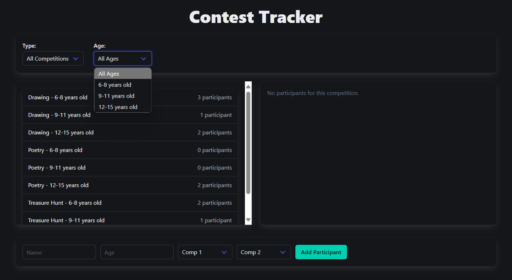

# Contest Management App 🏆

A full-stack web application for managing competitions and participant enrollment, with support for multiple users. Built with a **React** frontend and a **Spring Boot** backend.

## 🌐 Features

- ✅ Multi-user login system
- ✅ Filter competitions by type and age category
- ✅ View participants for selected competitions
- ✅ Enroll participants into available competitions
- ✅ RESTful API with full CRUD support
- ✅ Clean and responsive UI

## 🧱 Tech Stack

| Layer       | Technology         |
|-------------|--------------------|
| Frontend    | React + TypeScript + Vite |
| Backend     | Java + Spring Boot + Hibernate |
| Data Format | JSON via REST API  |

---

## ▶️ Running the App Locally

### 1️⃣ Backend (Spring Boot)

1. Navigate to the backend directory:
```bash
cd backend
```
2. Run the Spring Boot app using Maven:
```
./mvnw spring-boot:run
```
  The server will start at http://localhost:8080

### 2️⃣ Frontend (React)
Open a new terminal and navigate to the frontend directory:

```bash
cd frontend
npm install
npm run dev
```
  The app will be available at http://localhost:5173

---

## 🔌 API Endpoints
Base URL: `http://localhost:8080/api/competitions`

| Method | Endpoint                 | Description              |
| ------ | ------------------------ | ------------------------ |
| GET    | `/api/competitions`      | Get all competitions     |
| GET    | `/api/competitions/{id}` | Get competition by ID    |
| POST   | `/api/competitions`      | Create new competition   |
| PUT    | `/api/competitions/{id}` | Update competition by ID |
| DELETE | `/api/competitions/{id}` | Delete competition by ID |
  Similar endpoints are available for /api/participants and /api/users.

---

## 🧪 Backend Testing
A manual test class is provided in backend/src/main/test/CompetitionTest.java which performs:

- POST: create a new competition
- GET: fetch all and by ID
- PUT: update an existing competition
- DELETE: remove a competition

You can run this file as a standalone Java application to test the REST API functionality.

🖼️ UI Overview
Once logged in, the app displays:

- filter bar to select competition type and age category
- list of competitions (left side)
- list of participants for the selected competition (right side)
- form to add new participants

  The UI is built with reusable React components, clean layout, and async data fetching via the REST API.
  
📸 Preview


